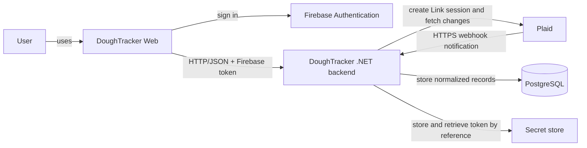
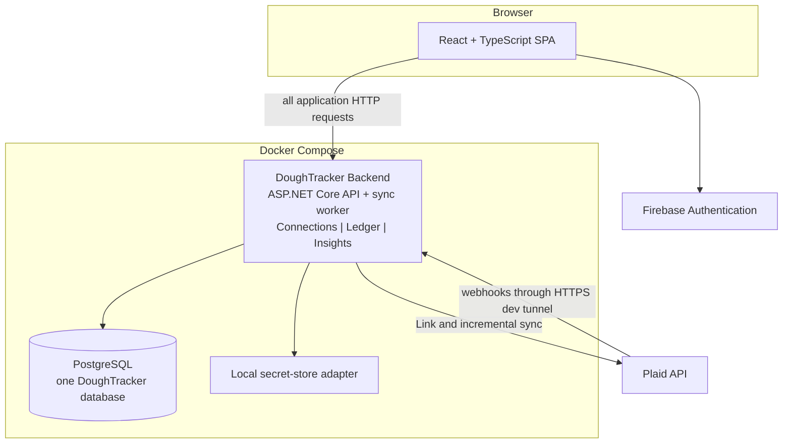
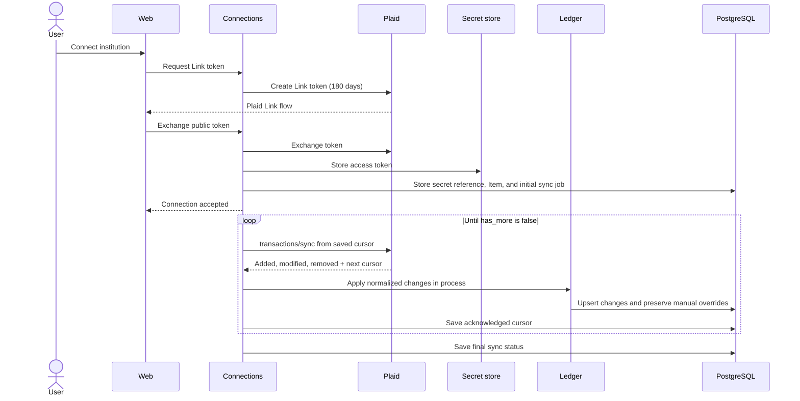

# DoughTracker Architecture Handoff

Status: Approved direction for the first expense-report release

Last updated: 2026-10-01

## 1. Purpose

DoughTracker is a personal-first replacement for Mint. Its first release is an
expense dashboard backed by connected US checking, savings, and credit-card
accounts. Later releases may add budgets, investments, retirement projections,
cash-flow forecasts, and net-worth tracking.

This document defines the project's durable boundaries. It intentionally does
not settle UI styling, library versions, column-level encryption, or other
implementation details that can be decided when their feature is built.

## 2. Architectural goals

1. Store a trustworthy local financial history and use cursor-based provider
   calls only to ask what changed since the last successful synchronization.
2. Keep provider-specific behavior out of the ledger and reporting domains.
3. Exercise clear domain boundaries, background work, retries, and
   observability without creating deployment or network boundaries prematurely.
4. Run the full application locally through Docker Compose at no cost.
5. Leave a credible path to Azure and multiple users without building either
   prematurely.

## 3. Version 1 scope

### Included

- Firebase sign-in with Google and email/password.
- Plaid Sandbox or a genuinely free live tier; no paid aggregation plan.
- Checking, savings, and credit-card accounts.
- Six months of initial transaction history when the institution provides it.
- Webhook-triggered incremental synchronization with hourly reconciliation as a
  fallback.
- Transaction browsing, searching, and filtering.
- Spending totals and charts by category and date.
- Plaid categories with persistent manual category overrides.
- Connection status and last-successful-sync visibility.
- Local account deletion and Plaid disconnection as separate operations.

### Deferred

- Budgets, investments, retirement holdings, forecasts, and net worth.
- Transaction splits, notes, and user-defined categorization rules.
- Event sourcing, strict CQRS, a message broker, and materialized report stores.
- Public cloud deployment and paid provider plans.
- Financial-field encryption design.
- Custom categories and formal downloadable reports.

## 4. System context



Plaid is a notification and ingestion source, not DoughTracker's system of
record. The Ledger module and PostgreSQL become the source of truth for the
normalized data shown by DoughTracker.

## 5. Application architecture



The backend is one deployable modular monolith. It is one .NET solution with an
executable Api project and multiple referenced class-library projects.
Connections, Ledger, and Insights remain code boundaries, but they call one
another in process; there are no internal HTTP APIs, service credentials, or
separate deployments.

The starting project layout is intentionally small:

```text
DoughTracker/
  DoughTracker.slnx
  src/
    API/                           # executable HTTP API and composition root
    Application/                   # use cases and orchestration
    Domain/                        # financial model and business rules
    Infrastructure/                # PostgreSQL, Plaid, and secret storage
  tests/
    Application.Tests/
    API.IntegrationTests/
```

The production reference graph is acyclic, not a single linear chain:

```text
API -> Application and Infrastructure
Application -> Domain
Infrastructure -> Application and Domain
```

`Domain` has no project dependencies. `Application` groups the Connections,
Ledger, and Insights use cases without requiring MediatR or strict CQRS.
`Infrastructure` depends on and implements contracts owned by Application.
`API` is the executable composition root: endpoint classes depend on
Application, while `Program.cs` references Infrastructure only to register its
implementations and start the application. Application tests exercise use cases
and domain rules; API integration tests boot Api and exercise the real HTTP
pipeline and PostgreSQL integration.

New finance capabilities first grow as feature folders through Domain,
Application, and Api. Split a capability such as Budgeting or Investments into
its own module projects only after it has a distinct model or release boundary;
do not create empty future modules now.

### 5.1 Web application

- React, TypeScript, and Vite.
- Independently built from the backend.
- Obtains a Firebase ID token and sends it as a bearer token to the public API.
- Talks to one backend API for institution workflows, transactions, and reports.
- Contains display state only; financial business rules belong in backend
  modules.

### 5.2 Connections module

Owns the lifecycle of external financial-data connections:

- Plaid Link-token creation and public-token exchange.
- A reference to each Plaid access token in the chosen secret store.
- Institution and Plaid Item metadata.
- Webhook verification and receipt.
- Incremental-sync cursor, hourly reconciliation, and connection health.
- A small PostgreSQL-backed durable job queue.
- Provider-to-canonical mapping before applying changes through Ledger classes.

The API and background worker run in the same backend process. A generic job
system is unnecessary for v1.

### 5.3 Ledger module

Owns canonical financial facts:

- Accounts and their latest balances.
- Transactions and pending/posted/removed state.
- Provider categories and manual overrides.
- Expense classification.
- Account deletion tombstones.
- Idempotent transaction upserts using provider identifiers.

Ledger never calls Plaid. Connections passes normalized changes to it through
an in-process method call.

### 5.4 Insights module

Owns report semantics:

- Spending summaries by date, account, and category.
- Dashboard totals and chart-ready responses.
- Exclusion of transfers and credit-card payments from expense totals.

Insights is stateless in v1. It queries normalized transaction data and
aggregates it in memory. This is deliberately sized for one user and a small
history. Add precomputed reporting tables only when measured report latency
justifies them.

## 6. Data ownership

| Data | Owner | Storage/access |
|---|---|---|
| Firebase identity | Firebase | Verified ID token |
| Plaid Item and institution metadata | Connections module | PostgreSQL |
| Plaid access token | Secret store | Connections module, by secret reference |
| Sync cursor and job status | Connections module | PostgreSQL |
| Account and balance | Ledger module | PostgreSQL |
| Transaction and category override | Ledger module | PostgreSQL |
| Expense report | Insights module | In-process query over PostgreSQL data |

One PostgreSQL database and one application database user are sufficient. Code
ownership is enforced by module folders and review, not separate databases or
credentials. Split storage only if a module later becomes an independently
deployed service.

Every user-owned row includes the Firebase `uid` as `owner_id`. Public API calls
derive it from the verified token; clients cannot supply or override it.

## 7. Logical data model

This is a logical starting point, not a migration specification.

### 7.1 Connections data

#### `financial_connections`

| Field | Purpose |
|---|---|
| `id` | Internal UUID |
| `owner_id` | Firebase UID |
| `provider` | `plaid` in v1 |
| `provider_item_id` | Plaid Item identifier |
| `institution_id` / `institution_name` | Display and support metadata |
| `secret_reference` | Pointer to the access token; never the token itself |
| `sync_cursor` | Last fully acknowledged Plaid sync cursor |
| `status` | `connected`, `attention_required`, or `disconnected` |
| `last_sync_at` / `last_error_code` | User-visible freshness and diagnosis |
| timestamps | Creation and update auditing |

#### `sync_jobs`

| Field | Purpose |
|---|---|
| `id` | Job UUID |
| `connection_id` | Connection to synchronize |
| `reason` | Initial link, webhook, hourly reconciliation, reconnect, or retry |
| `status` | Pending, processing, completed, or failed |
| `attempt_count` / `available_at` | Bounded retry scheduling |
| `last_error_code` | Sanitized failure reason; never provider secrets |
| timestamps | Job lifecycle auditing |

### 7.2 Ledger data

#### `accounts`

| Field | Purpose |
|---|---|
| `id` | Internal UUID |
| `owner_id` | Firebase UID |
| `connection_id` | Foreign key to the owning financial connection |
| `provider_account_id` | Stable provider account key |
| `institution_name`, `name`, `mask` | User-facing identity |
| `type`, `subtype` | Checking, savings, or credit card |
| `current_balance`, `available_balance`, `currency` | Latest known balance |
| `connection_status` | Current connectivity without erasing history |
| `deleted_at` | Tombstone preventing a deleted account from being reimported |
| timestamps | Auditing |

#### `transactions`

| Field | Purpose |
|---|---|
| `id` | Internal UUID |
| `owner_id`, `account_id` | Ownership and parent account |
| `provider_transaction_id` | Idempotent provider key |
| `pending_transaction_id` | Pending-to-posted reconciliation |
| `amount` | Signed `numeric(19,4)`; inflow positive, outflow negative |
| `currency` | ISO currency code |
| `authorized_date`, `posted_date` | Provider dates without invented precision |
| `merchant_name`, `description` | Search and display values |
| `pending` | Current provider state |
| `provider_category_key` | Plaid's category |
| `manual_category_id` | Nullable user override |
| `classification` | Income, expense, transfer, or credit-card payment |
| `removed_at` | Provider removal without destroying reconciliation history |
| timestamps | Auditing |

`effective_category = manual_category ?? provider_category`.

#### `categories`

A seeded lookup containing the v1 category taxonomy. User-created categories
are deferred.

## 8. REST API boundaries

The single backend API uses JSON over HTTP, publishes one OpenAPI document, and
uses a versioned `/api/v1` prefix. Endpoint groups preserve module ownership;
exact DTOs belong to implementation design.

### Connections

- `POST /api/v1/connections/link-token`
- `POST /api/v1/connections/exchange-token`
- `GET /api/v1/connections`
- `POST /api/v1/connections/{id}/reconnect`
- `DELETE /api/v1/connections/{id}`
- `POST /webhooks/plaid`

The webhook endpoint does not use Firebase authentication. It verifies the
provider signature, persists/coalesces a sync job, and returns promptly.

### Ledger

- `GET /api/v1/accounts`
- `DELETE /api/v1/accounts/{id}`
- `GET /api/v1/transactions`
- `PATCH /api/v1/transactions/{id}/category`

### Insights

- `GET /api/v1/reports/spending`
- `GET /api/v1/reports/summary`

Common filters are date range, account, and category. Pagination belongs on
transaction APIs, not aggregate reports.

The backend verifies the Firebase token once at the API boundary. Every module
receives the verified UID and scopes its database work to that owner.

## 9. Synchronization flow



After initial synchronization, the `SYNC_UPDATES_AVAILABLE` webhook creates
another durable sync job. The webhook is only a notification; the worker calls
`/transactions/sync` with the saved cursor to retrieve added, modified, and
removed records.

Connections also schedules one coalesced reconciliation job per connected Item
at startup and at most once per hour. This catches changes after missed
webhooks or local downtime. Opening a dashboard or report reads the complete
local history immediately; if the connection has not been checked within the
hour, the request may enqueue the same non-blocking reconciliation job. It does
not wait on Plaid.

Calling `/transactions/sync` does not make Plaid contact the institution. Plaid
normally checks institutions on its own schedule, typically one to four times
per day, and then sends the webhook when it finds changes. The on-demand
`/transactions/refresh` add-on can force a new institution check, but it has a
separate fee model and is excluded while the project has a $0 provider budget.

### Synchronization guarantees

- Each page's records and cursor are committed atomically in PostgreSQL.
- A crash restarts from the last committed cursor.
- Replayed pages are safe because transaction writes upsert on provider IDs.
- Provider modifications update source fields but never clear a manual category.
- Provider removals mark transactions removed so reports stop counting them.
- Retries use bounded exponential backoff and respect provider rate-limit hints.
- A permanently failed job remains visible for diagnosis instead of being
  silently discarded.
- Webhook and scheduled triggers coalesce so they cannot start overlapping syncs
  for the same connection.

## 10. Reporting rules

- A credit-card purchase is an expense.
- A payment from checking to a credit card remains visible in transaction and
  cash-flow views but is classified as a credit-card payment and excluded from
  expense totals.
- Transfers remain available for reconciliation but are excluded from expense
  totals.
- Removed transactions are excluded.
- Pending transactions are visible and clearly labeled; reports include them
  only if the product decision for that report explicitly says so.
- Manual category overrides always win over later provider updates.

## 11. Account lifecycle

### Plaid disconnect

1. Revoke/remove the provider connection when possible.
2. Delete its access token from the secret store.
3. Mark the connection and associated accounts disconnected.
4. Retain accounts and transaction history.

### Local account deletion

1. Authorize ownership from the Firebase UID.
2. Mark the account with a tombstone.
3. Delete its transactions and derived report data.
4. Ignore future provider changes for that account so a later Item sync does not
   recreate it accidentally.

Deleting one local account does not implicitly disconnect every account in the
same Plaid Item.

## 12. Authentication and security boundaries

- Firebase handles Google and email/password authentication.
- The backend verifies the Firebase ID token at its public API boundary.
- Authorization always scopes reads and writes to the token's UID.
- Plaid access tokens and provider secrets live in a secret store. Databases
  contain only secret references.
- Logs exclude tokens, complete provider payloads, and financial descriptions.
- Webhooks are signature-verified before they can create work.
- PostgreSQL is reachable only on the Compose network unless a developer
  explicitly exposes it.
- Field-level financial-data encryption is an implementation decision. It must
  start with a threat model because encrypting query fields changes search and
  aggregation.

The local secret-store product and HTTPS development-tunnel product remain open
implementation choices.

## 13. Reliability and observability

The backend provides:

- Liveness and readiness endpoints.
- Structured logs with request, connection, job, and correlation identifiers.
- Timeouts on all network calls.
- Retry only where the operation is idempotent.
- Sanitized error responses and internal exception logging.

The user-facing UI shows connection state, last successful sync time, and a
recoverable action when reauthentication is required.

### Initial application objectives

- Process and expose a received Plaid update within 10 seconds under normal
  local conditions.
- Never duplicate a transaction because a webhook or HTTP request is retried.
- Keep a manual category after any provider modification.
- Start the local system with one documented Docker Compose command.

The first objective begins when DoughTracker receives a webhook or starts an
hourly reconciliation. It does not promise that an institution will notify
Plaid in real time.

## 14. Local and future deployment

### Local v1

Docker Compose runs:

- Web SPA development server.
- One .NET backend containing the API, domain modules, and sync worker.
- PostgreSQL.
- The selected local secret store, when real tokens are introduced.

A development HTTPS tunnel is required only when Plaid must deliver real
webhooks to localhost. Sandbox webhook fixtures should cover normal development.

### Future Azure mapping

| Local component | Likely Azure target |
|---|---|
| React static build | Static Web Apps or static storage/CDN |
| .NET backend and worker | Azure Container Apps |
| PostgreSQL database | Azure Database for PostgreSQL |
| Secret store | Azure Key Vault |
| Logs and traces | Application Insights |

This is a migration map, not a v1 deployment commitment. Azure Service Bus and
internal service-to-service networking are not part of the current
architecture.

## 15. Architecture decisions

### AD-1: Modular monolith

**Decision:** Deploy one .NET backend assembled by API from Application,
Domain, and Infrastructure projects. Connections, Ledger, and Insights remain
feature folders/namespaces across the relevant projects.

**Why:** The modules preserve domain boundaries and make the architecture easy
to reason about without multiplying deployments, network calls, authentication,
and failure modes.

**Revisit when:** A module needs independent scaling, deployment cadence, or
failure isolation strongly enough to justify its operational cost.

### AD-2: In-process calls before messaging

**Decision:** Modules call concrete application classes in process. Connections
uses a narrow PostgreSQL job queue for webhook and scheduled sync work.

**Why:** It satisfies the v1 flow without internal HTTP, a broker, an emulator,
or an event-contract lifecycle.

**Revisit when:** A real asynchronous fan-out or independent deployment need
appears.

### AD-3: A normalized local ledger

**Decision:** Persist six months of initial history and all later incremental
changes in Ledger. Every later Plaid sync uses the saved cursor and asks only
for changes.

**Why:** Reporting, search, recategorization, provider outages, and future
budgets require a stable local source of truth.

**Read behavior:** Screens and reports use the complete local history. A stale
read may trigger a non-blocking incremental sync, but rendering never depends on
a live Plaid response.

### AD-4: One application database

**Decision:** Use one PostgreSQL database and one application database user.
Tables still have a clear owning module in code.

**Why:** Separate databases add migrations, credentials, and coordination
without helping a personal v1 application.

### AD-5: Firebase identity from the start

**Decision:** Use Firebase Google and email/password sign-in, and place its UID
on every user-owned record.

**Why:** It avoids building authentication and prevents a future multi-user data
migration.

### AD-6: Plaid behind the Connections module

**Decision:** Only Connections understands Plaid DTOs, tokens, and cursors.

**Why:** The other modules remain stable if cost, availability, or coverage
later requires another aggregator.

**Constraint:** Do not create institution-specific adapters unless a real
institution behavior requires one.

### AD-7: No strict CQRS or event sourcing

**Decision:** Organize each module by vertical use-case slices, but use ordinary
relational state and HTTP handlers.

**Why:** The project still exercises architectural boundaries without adding
dual models, replay rules, or mediator ceremony that v1 does not need.

## 16. Implementation order

1. Create the .NET solution; API, Application, Domain, and Infrastructure
   projects; both test projects; and the Docker Compose environment.
2. Add Firebase authentication and UID-based API authorization.
3. Build Ledger account, transaction, filtering, and recategorization endpoints
   with deterministic mock data.
4. Build Insights reports over Ledger data and the React dashboard against the
   backend API.
5. Build Connections with a fake provider matching the normalized sync batch.
6. Add Plaid Sandbox Link, 180-day initialization, webhook handling, and cursor
   synchronization.
7. Add disconnect, deletion tombstones, retries, health status, and failure UI.
8. Add integration checks, structured logging, and the local operations guide.

This order keeps the product usable with mock data while the external provider
work is completed.

## 17. Handoff acceptance scenarios

The architecture is implemented when all of these scenarios are demonstrable:

1. `docker compose up` starts the local application and its dependencies.
2. A signed-in user can connect a Plaid Sandbox Item and receive available
   history from the requested 180-day window.
3. A duplicate webhook or repeated sync batch does not duplicate transactions.
4. Added, modified, and removed provider transactions appear correctly.
5. An hourly reconciliation catches changes after a webhook is missed.
6. A manual category survives a later provider update.
7. Date/category/account filters and spending charts agree with Ledger data.
8. Transfers and credit-card payments do not inflate expense totals.
9. Disconnecting Plaid retains history and removes the stored access token.
10. Deleting an account removes its transactions and prevents reimport.
11. One Firebase user cannot read or mutate another user's records.
12. Plaid or backend failure produces a visible retryable sync failure rather
    than silent data loss.

## 18. Open implementation decisions

These are intentionally postponed until the related implementation starts:

- Local secret-store selection.
- Local HTTPS tunnel selection.
- Financial-field encryption threat model and design.
- Component library, styling system, and chart library.
- Exact .NET, Node, React, and PostgreSQL versions.
- Plaid Trial eligibility and whether required institutions are available at
  zero cost.
- Azure cost review and infrastructure-as-code choice.

## 19. Primary external references

- [Plaid Transactions overview](https://plaid.com/docs/transactions/)
- [Plaid Transactions Sync API](https://plaid.com/docs/api/products/transactions/)
- [Plaid transaction webhooks](https://plaid.com/docs/transactions/webhooks/)
- [Plaid webhook delivery and retries](https://plaid.com/docs/api/webhooks/)
- [Plaid Link API](https://plaid.com/docs/api/link/)
- [Firebase server-side ID-token verification](https://firebase.google.com/docs/auth/admin/verify-id-tokens)
- [Firebase web authentication](https://firebase.google.com/docs/auth/web/start)
- [Azure Container Apps](https://learn.microsoft.com/azure/container-apps/)
- [Azure Database for PostgreSQL](https://learn.microsoft.com/azure/postgresql/overview)
